# redis学习笔记
## redis概述
支持生存时间，可以用于缓存系统；支持异步持久化。
一个redis实例提供若干个存储数据的字典，默认支持16个字典。
每个字典可以理解成一个独立的数据库。
数据库从0开始递增，不支持用户重命名。
不同的应用应该使用不同的redis实例，不应该使用数据库0存储应用1，而使用数据库1存储应用2。
redis 默认使用数据库0。 
redis命令不区分大小写。 
redis的键推荐命名方式(多个单词使用.分割)：对象类型:对象id:对象属性，例如：user:1:act.age
## redis 常用命令
- 登录redis：redis-cli -h 127.0.0.1 -p 6379
- 查看redis服务器的版本：redis-server.exe -v
- 查看redis客户端版本：redis-cli.exe -v
- 设置值：set key value
- 获取值：get key
- 查看所有key值：keys *
- 删除指定索引的值：del key  [key2 key3....]
- 清空整个 Redis 服务器（db0-db15所有）的数据：flushall 
- 清空当前库（db0-db15其中一个）中的所有 key：flushdb
- db0-db15库之间切换：select 1
- 判断一个健是否存在：exists key1 [key2 key3....]
- 获得键值的数据类型：type key
- 递增整数键值：incr key.键不存在则新建，并返回1
- 递减整数键值：decr key
- 增加指定整数的键值： incrby key increment
- 增加指定整数的键值： decrby key increment
- 增减浮点数：incrbyfloat(无decrbyfloat命令) key increment

## redis的数据类型
### 字符串类型
redis最基本的数据类型，最大可以存储512MB的数据。
#### 操作命令
- 向字符串类型的键值尾部追加值：append key value,例如 append num 12
- 获取字符串类型键值的长度：strlen key
- 获取/设置多个键值：mget key1 key2/mset key1 value1 key2 value
### 散列类型
散列类型也是一种字典结构，其存储了字段(field)和字段值的映射，且字段值必须是字符串类型，不支持其他类型。

#### 操作命令
- 设置：hset key field value,例如 hset user name lihua
- 取值: hget key field,例如 hset user name
- 设置多个值/获取多个值：hmset/hmget
- 判断字段是否存在：hexists key field
- 当字段不存在时赋值，存在不做任何操作：hsetnx key field
- 删除字段：hdel key field
- 增加数字：hincrby key field increment
- 只获得字段名/字段值：hkeys key/hvals key
- 获得字段的数量：hlen key
- 获取键的所有值：hgetall key
### 列表类型
可以存储一个有序的字符串列表，内部使用的是双向链表实现的，所以向链表两端添加或者获得元素的速度
是极快的。但是通过索引访问元素是比较慢的，也就是从几千万中找到特定的某条数据是比较慢的。
#### 操作命令
- 向列表两端增加元素： 
rpush key value[value1 value2....] 
lpush key value[value1 value2....]
- 从列表两端弹出元素 
lpop key  
rpop key
- 获得列表元素个数:llen key
- 获得列表的片段：lrange key start end,下标从0开始，且包含start、end下标的元素
- 删除列表指定的值：lrem key count value 
count>0,从最左边开始，删除count个值为value的元素
count<0,从最右边开始，删除count个值为value的元素
count=0,删除所有值为value的元素
### 集合类型
无序的、唯一性，常用操作是向集合添加、删除元素或者判断某个元素是否存在等。
#### 操作命令
- 增加/删除元素 
sadd key member[member1 member2....] 
srem key member[member1 member2....]
- 获得所有的元素：smembers key
- 判断元素是否在结合中：sismember key member
- 集合运算 
差集：sdiff key [key1 key2...] 
交集：sinter key [key1 key2...] 
并集：sunion key [key1 key2...] 
- 获得集合元素个数：scard key
- 随机获得元素：srandmember key[count] 
count>0,获得count个不重复元素；
count<0,获得count个可能重复的元素
- 从集合中弹出一个元素(随机的)：spop key [count]
### 有序集合类型
在集合的类型的基础上有序集合类型为集合中的每个元素都关联了一个分数，集合的元素不允许相同，但是分数是允许相同的。
有序集合采用的是散列表和跳跃表实现的，因此，有序集合类型访问中间的元素也很快，不同于集合类型。
#### 操作命令
- 增加元素：zadd key score member[score member]
- 获得元素分数：zscore key member
- 获得排名在某个范围内的元素列表 
升序：zrange key start end [withscores] 
降序：zrevrange key start end [withscores]
- 获取指定分数范围的元素 
zrangebyscore key min max [withscores] [limit offset count]
- 增加一个元素的分数：zincrby key increment member 
例如 zincrby math -6 lisi
- 获得集合元素的个数：zcard key
- 获得指定分数范围的元素个数：zcount key min max
- 删除元素：zrem key member[member....]
- 获得元素的排名 
升序：zrank key member
降序：zrevrank key member
- 计算有序集合的交集 
 zinterstore destination numkeys key [key ...] [WEIGHTS weight] [AGGREGATE SUM|MIN|MAX] 
 destination:交集的结果的key 
 numberkeys:参与运算的集合个数 
 [WEIGHTS weight]:设置每个集合的权重，例如两个集合运算，则权限可以为 0.5 0.5
 [AGGREGATE SUM|MIN|MAX]：交集元素的分数计算方式，sum参与运算的和
- 计算有序集合的并集 
 zunionstore destination numkeys key [key ...] [WEIGHTS weight] [AGGREGATE SUM|MIN|MAX]

## redis事务
redis中的事务是一组命令的集合。事务同命令一样都是redis最小的执行的单位，一个事务中的命令要么都执行，要么
都不执行。 
语法错误，所有的命令都将不执行(v2.6.5)；运行错误，正确的命令将得到执行。 
redis没有提供事务回滚的功能。 
multi 开启一个事务。
### watch命令
可以监控一个或者多个键，一旦一个键被修改或者被删除，之后的事务就不会再执行，一直持续到exec命令。
执行exec命令会取消所有的键的监控。unwatch命令也可以取消对键的监控。
## 过期时间
### 操作命令
- 设置键过期时间：expire key seconds 
- 设置键过期时间：pexpire key milliseconds
- 查看键还有多久存活时间：ttl key,当键不存在，返回-2(v2.6)；没有设置键的过期时间，则返回-1。
- 清除键的过期时间： persist key，清除成功，返回1。
## 实现缓存
最佳实践：限制redis最大使用的内存，并让redis按照一定的规则淘汰不需要的键。设置方法为：修改配置文件的maxmemory参数，
限制redis使用的最大内存，超过限制redis会按照maxmemory-policy参数指定的策略来删除不需要的键。
redis淘汰键的策略如图：

## 排序
sort 命令可以对列表类型、集合类型和有序集合类型的键进行排序。
-  sort key [BY pattern] [LIMIT offset count] [GET pattern [GET pattern ...]] [ASC|DESC] [ALPHA] [STORE destination] 
ALPHA：对非数值型的键值按照字典的顺序排序。 
by 参考键，参考键可以是字符串类型键或者散列类型键的某个字段(表示键名->字段名),例如：sort mylist by user:*->name desc 
get 参考键，参考键可以是字符串类型键或者散列类型键的某个字段(表示键名->字段名),例如：sort mylist by user:*->name desc get user:*->age 
store 参数保存排序结果，destination为键名
#### 排序性优化
sort排序大量数据时，严重影响性能。
+ 尽可能的使排序的数据量小
+ 尽可能使用limit参数只获取需要的数据
+ 尽可能使用store参数将结果缓存

## 消息通知
### 任务队列
 使用列表可以很容易的实现队列，使用lpush添加任务，使用rpop取出任务。
 rpop可以使用brpop命令替换，rpop会一直从列表中去数据，不管是否存在新任务；brpop如果没有新任务，则会一直阻塞。 
 brpop key [key ...] timeout timeout为0表示不限制阻塞时间，不为0，则超过timeout会返回nil 
### 优先级队列
brpop key [key ...] timeout 该命令可以检测多个键，从左到右优先级越来越低。
### 发布/订阅模式
- 发布者发布消息： publish channel message 向channel频发布message消息。消息不会持久化。
- 订阅者订阅频道： subscribe channel [channel ...] 订阅多个频道
- 按照规则通配符订阅频道：psubscribe pattern [pattern ...]
## 管道
客户端与redis使用tcp协议连接，因此存在网络时延，对性能有一定影响。
如果用户命令不需要等待上一次执行的结果，则可以使用管道技术，一次性发送若干条命令减少网络时延。
## 节省空间
redis数据存储在内存中，如何节省内存空间显得尤为重要。

- 精简键名和键值
- 内部编码优化：redis为每种数据类型都提供了两种内部编码方式。查看键的编码方式命令object encoding key

##脚本(v2.6)
允许用户使用Lua语言编写脚本传到redis中执行。使用脚本的好处：

- 减少网络开销：较少执行命令的数量。
- 原子操作：redis将整个脚本当作一个整体执行，无需考虑事务。所有事务可以完成的功能都可以使用脚本来实现。
- 复用：客户端发送的脚本会永久存储在redis中，其他客户端可以复用这一脚本而不需要使用代码完成同样的逻辑。
### Lua语言
Lua是一个高效的轻量级脚本语言，能方便地嵌入到其他语言中使用。
redis提供Lua脚本的目的就是为了让开发者自己扩展redis。
#### Lua语法
Lua是一个动态语言，一个变量可以存储任何类型的值。
#####数据类型
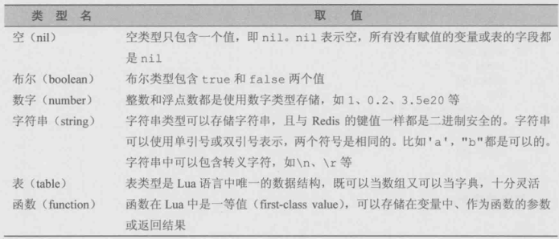
##### 变量
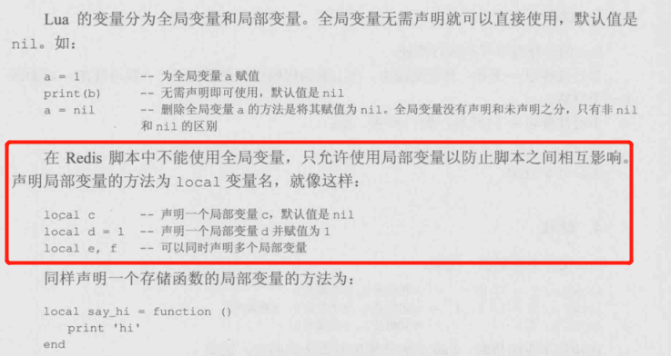
变量名必须是非数字开头，只能包含字母、数字和下划线，区分大小写。
##### 注释
- 单行注释：--
- 多行注释：--[[ ]]
##### 赋值
Lua支持多重赋值 
local a,b=1,4 --a=1，b=4 
local a,b=3  --a=3,b=nil
##### 操作符
######数学操作符
+、-、*、/、%(取模)、-(一元操作符，取负)、^(幂运算符)
###### 比较运算符
==、~=(不等于)、<、>、>=、<=
###### 逻辑操作符
not and or
###### 连接操作符
..用于连接两个字符串
######取长度操作符(v5.1)
\# 用于获取字符串或者表的长度
#####if语句
**Lua中只有nil和false才是假**
#####循环语句
Lua支持while、repeat、for
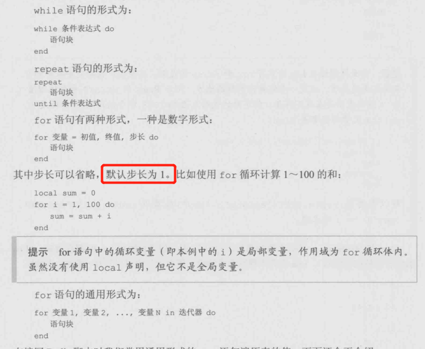
#####表类型
表是Lua唯一的数据结构，任何类型的值(除了空类型)都可以作为表的索引。
 定义方式：
a={}，例如a={name=lisi,age=34}、b[name]=lisi
##### 函数
定义方式 
function (参数列表) 
函数体 
end 
或者赋值给一个变量 
local a=function getValue(num) 
    return num\*num 
end 
或者将变量定义写在function后面，返回结果赋值给value变量 
local function value(num) 
    return num*num        
end
### redis与Lua脚本
redis的脚本执行是原子性的，即执行脚本期间不会执行其他命令。除了shutdown nosave、shutdown、script kill命令外，
所有的命令必须等待脚本执行完才可以执行。
####在脚本中调用redis命令
使用redis.call函数调用redis命令，例如redis.call('set',key,value); 
redis.call函数返回的结果就是redis命令执行的结果，返回结果5种数据类型会转换成Lua对应的数据类型。 
redis还提供了redis.pcall函数，该函数会记录错误并继续执行，而redis.call直接返回错误。 
同样地，redis会将从脚本返回的数据转换成redis的数据类型。
####脚本相关命令
#####eval命令
 EVAL script numkeys key [key ...] arg [arg ...] 
- script： 参数是一段 Lua 5.1 脚本程序。脚本不必(也不应该)定义为一个 Lua 函数。
- numkeys： 用于指定键名参数的个数。
- key [key ...]： 从 EVAL 的第三个参数开始算起，表示在脚本中所用到的那些 Redis 键(key)，这些键名参数可以在 Lua 中通过全局变量 KEYS 数组，用 1 为基址的形式访问( KEYS[1] ， KEYS[2] ，以此类推)。
- arg [arg ...]： 附加参数，在 Lua 中通过全局变量 ARGV 数组访问，访问的形式和 KEYS 变量类似( ARGV[1] 、 ARGV[2] ，诸如此类)。

 例如eval "return redis.call('set', KEYS[1],ARGV[1])" 1 num 56
#####evalsha命令
考虑脚本较长的情况下，如果都将整个脚本传给redis会占用较多的带宽。通过脚本的sha1摘要来执行脚本，用法和
eval命令一样，将脚本替换成sha1摘要即可。
####深入脚本
#####KEYS与ARGV
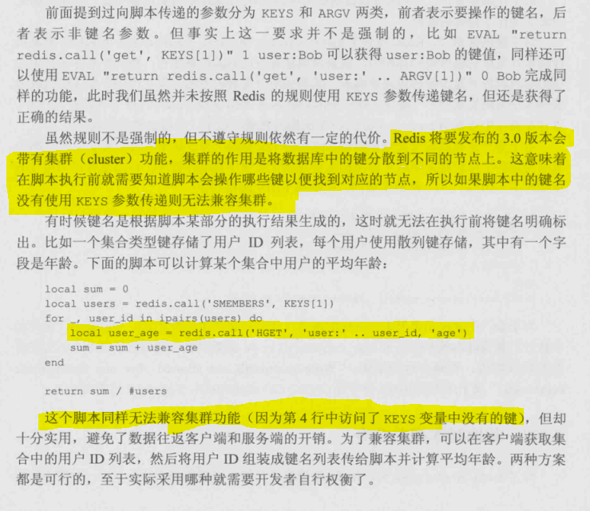
#####沙盒和随机数
redis脚本禁止使用Lua标准库中与文件或者系统调用相关的函数，只允许对redis数据进行处理。redis还禁用脚本的全局变量的方式保证每个脚本都是相对
隔离的，互不干扰。
#####其他脚本相关命令
- SCRIPT LOAD命令：将脚本加入缓存，SCRIPT LOAD script
- Script Exists命令：用于校验指定的脚本是否已经被保存在缓存当中script exists sha1
- Script Flush命令:清空脚本缓存
- Script kill命令：强制终止当前脚本的执行，如果脚本执行修改数据库的操作，该命令将是无效的。
## 持久化
redis支持两种方式的持久化

- RDB：根据指定的规则定时将内存中的数据存储到硬盘中。
- AOF：每次执行完命令后将命令本身保存下来。
### RDB方式
通过快照完成的，当符合一定条件时，redis会自动将内存中的数据生成一个副本并保存到硬盘上，这个过程就是快照
以下情况对数据进行快照：
- 根据配置规则进行自动快照。
- 用户执行了save或者bgsave命令
- 执行flushall命令
- 执行复制
#### 根据配置规则进行自动快照
配置文件中save seconds keynums，例如save 90 2在90秒内有两个或者以上键被更改，则进行快照。条件可以配置多个，条件之间是**或**的关系
#### 用户执行了save或者bgsave命令
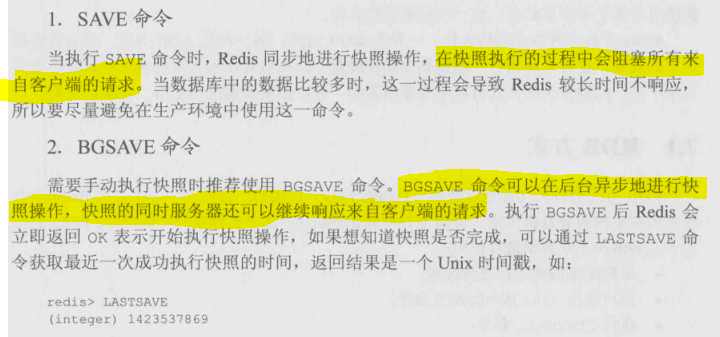
#### 执行flushall命令
flushall命令会清除数据库所有的数据，当没有自定义自动快照条件时，执行flushall命令是**不会**进行快照的。
否则不管是否满足自动快照条件，都会进行快照。
####快照的原理

####RDB缺点
redis启动后读取RDB快照文件，将数据载入到内存中。如果redis异常退出，就会丢失最后一次快照以后更改的所有数据。
希望将损失降低到最小，使用AOF方式
###AOF方式
####开启AOF
默认情况下redis没有开启AOF方式持久化
appendonly yes开启 
appendfilename "appendonly.aof" 指定文件名
####AOF的实现
AOF已纯文本的形式记录了redis的写命令。 
随着执行的命令越来越多，AOF的文件也越来越大，冗余的命令也会越来越多。
redis提供了自动优化AOF文件的功能，达到配置文件的条件时就会重写AOF文件或者可以手动执行
bgrewriteaof命令执行AOF文件重写。 
配置条件如下：
- auto-aof-rewrite-percentage 100：目前的AOF文件大小超过上一次重写时的AOF文件大小的百分之多少时重写
- auto-aof-rewrite-min-size 64mb：AOF文件多大时执行重写文件
####同步硬盘数据
由于数据库的缓存机制，在默认的情况下系统每30s执行一次同步操作，以便将硬盘缓存数据真正地写入硬盘。AOF
无法忍受这样的数据丢失，需要redis写入AOF文件后主动要求系统将缓存内容同步到硬盘中，方式系统突然奔溃。
- appendfsync always：每次执行写入都会执行同步
- appendfsync everysec：默认，每秒执行一次同步操作，一般使用默认值即可
- appendfsync no：不主动进行同步
###AOF和RDB方式都开启
redis允许AOF和RDB方式都开启，既保证数据的安全性又使得备份等操作十分容易。
重启redis,redis会从AOF文件来恢复数据。

##集群
单台redis服务器存在单点故障，而且单个服务器内存也会很容易成为瓶颈，故采用集群势在必行。
### 复制
####配置
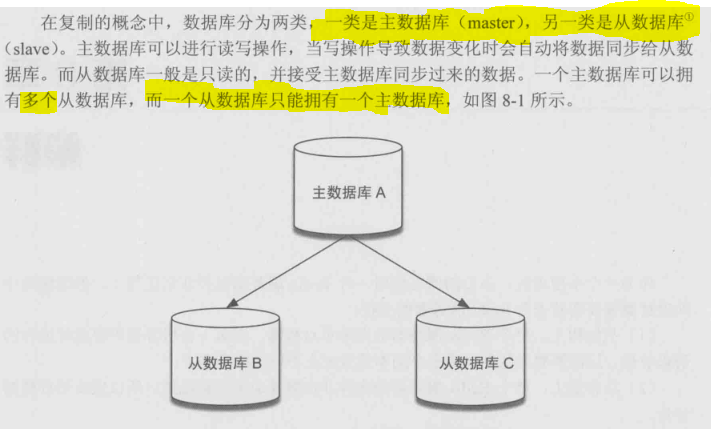
实现复制功能：在从数据库的配置文件中加入 slaveof 主数据库地址 主数据库端口，主数据库无需任何配置。 
\# slaveof \<masterip> \<masterport>
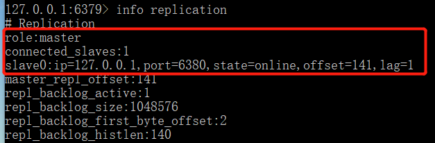
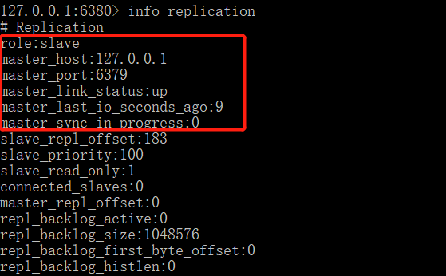
####原理
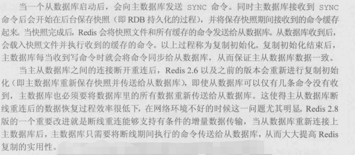
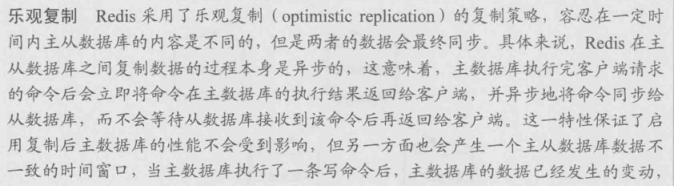
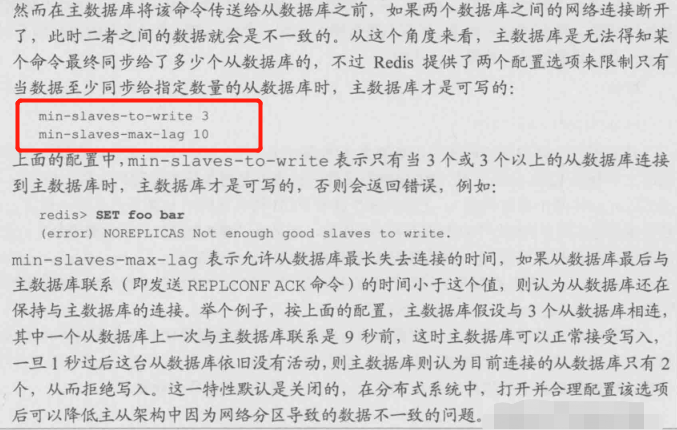
###哨兵
###集群
##管理
###安全性
###管理工具

